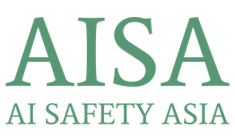

  

<h1 align="center">AI Safety Asia (AISA)</h1>

  <strong>Trustworthy, primary-source AI-governance intelligence for Southeast Asia.</strong>

  
  
  

---

## 🌏 Who we are

**AI Safety Asia (AISA)** is a non-profit dedicated to building Asia as a globally-leading safe
and responsible AI innovator. We produce **trustworthy, primary-source AI-governance
intelligence** and **build regional capacity** — working to be the single source of truth for AI
governance across the 11 ASEAN jurisdictions, where information is otherwise scattered across
government portals and many languages.

We serve regulators, parliamentary teams, legal & compliance teams, journalists, civil society,
public-sector leaders, and researchers who need contextual AI-governance intelligence they can
trust.

## 🧭 What we do

Our work turns research and collaboration into real change across three pillars:

- **🌉 Convening** — we build bridges between policymakers, researchers, and industry leaders to turn AI challenges into shared governance frameworks.
- **🔬 Research & Governance Studies** — we conduct multi-country studies, policy analyses, and regional reports that guide evidence-based AI governance decisions.
- **🎓 Capacity Building** — we design programs that empower institutions and individuals to understand, regulate, and innovate responsibly with AI.

## 📦 Projects & programs

| Project | What it is |
| --- | --- |
| **[SEA Observatory](https://www.seaobservatory.org/)** | Our flagship: a Southeast Asia AI-policy repository (browse & compare governance documents across the 11 ASEAN jurisdictions) plus a multilingual, source-cited AI assistant. |
| **[China AI Governance Map](https://china-ai-governance-map.vercel.app/network)** | An interactive map of China's AI-governance landscape — the actors, institutions, and their relationships. |
| **RAISE SEA** | *Responsible AI Scenario Exploration for Southeast Asia* — research producing regional scenario forecasts. |
| **[GovSim](https://govsim-web-production.up.railway.app/)** | A multiplayer AI-governance scenario-simulation platform for rehearsing policy decisions (trialed with KOMDIGI, Indonesia). |
| **Cooperative AI Program (CAI-Asia)** | Cohort program with the Cooperative AI Foundation, feeding the AISA Lab Studio incubator and Pioneer Society community. |
| **Intelligence Rising** | An AI-governance simulation game, in partnership with HKU. |
| **AISA Accords** | Our vision for an Asian diplomatic framework on AI governance. |
| **Convenings & training** | Roundtable and forum series, and governance training for parliaments and ministries. |

> Explore all of our work at **[aisafety.asia](https://www.aisafety.asia/)**. Public code lives
> in the repositories below.

## 🤝 Partners & funders

**Partners & collaborators** — Cooperative AI Foundation · IMDA (Singapore) · KOMDIGI (Indonesia)
· Korika · DOST (Philippines) · The Future Society · NUS AI Institute · Singapore Management
University.

**Funders** — FCDO (UK) · Open Society Foundation · Patrick J. McGovern Foundation · Future of
Life Institute · Long-Term Future Fund · Survival & Flourishing Fund.

## 📫 Get in touch

- 🌐 Website — **[www.aisafety.asia](https://www.aisafety.asia/)**
- ✉️ Email — **[contact@aisafety.asia](mailto:contact@aisafety.asia)**

Together, we're building a safer digital future for Asia.

